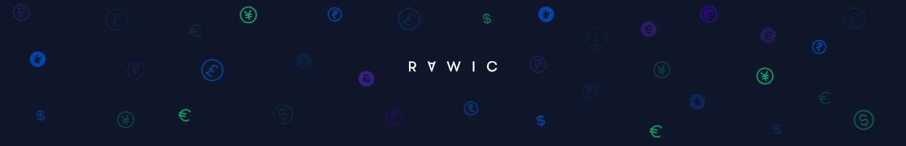
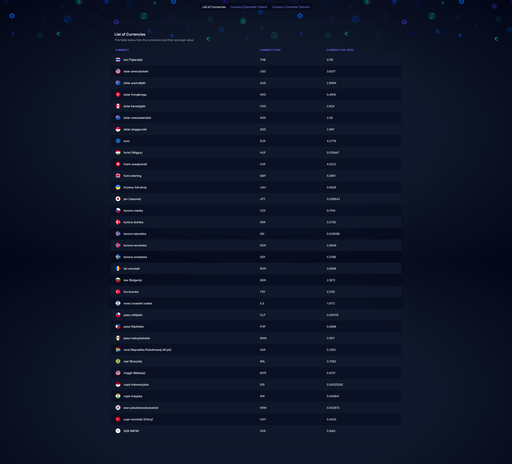

<p align="center">
  <a href="https://github.com/rawic/nbp-currency-app">
    
  </a>

  <h3 align="center">NBP Currency App</h3>

  <p align="center">
    Web application to view and analyze currency exchange rates using the NBP (National Bank of Poland) public API.
    <br />
    <a href="https://nbp-currency-app.vercel.app/" target="_blank" rel="noopener noreferrer"><strong>Live demo »</strong></a>
    <br />
    <br />
    <a href="https://github.com/rawic/nbp-currency-app/issues">Report Bug</a>
    ·
    <a href="https://github.com/rawic/nbp-currency-app/issues">Request Feature</a>
  </p>
</p>

## About NBP Currency App

<a align="center" href="https://github.com/rawic/nbp-currency-app" rel="nofollow noopener noreferrer" target="blank">
  
</a>

### ✨ Features

- ✅ Display the current exchange rates fetched from the NBP API
- ✅ View currency details and historical exchange rates
- ✅ Interactive charts showing currency rate changes over the last 30 days
- ✅ Date range picker for custom time period analysis
- ✅ Currency converter between PLN and other currencies
- ✅ Server and client-side conversion with live data

### 🔧 Improvements / Future Enhancements

This section outlines potential improvements that could be implemented in the project to enhance its functionality, performance, and maintainability:

- **Improve API Error Handling**: Enhance error handling in terms of UX/UI to give users a clearer understanding when issues occur.
- **Skeleton Loading State**: Add skeletons or loading indicators when fetching data to improve the user experience.
- **Leverage Streaming More**: Increase the use of streaming for data fetching, as currently some parts of the content are blocked while waiting for data.
- **Separate Fetchers into Files**: Move data fetching logic into separate files to adhere to better code organization and separation of concerns.
- **Testing**: Introduce at least unit tests to ensure code quality and reliability.
- **API Rate Limiting**: Implement mechanisms to prevent users from spamming the API with too many requests.
- **Husky for Pre-Commit Hooks**: Use Husky to run linting and Prettier checks on each commit to maintain code style and quality automatically.
- **Reusable Components**: Add more reusable components (e.g., buttons) to improve maintainability and consistency across the app.

### 🛠️ Built with

- **Next.js** (App Router)
- **React** (with TypeScript)
- **Tailwind CSS** for styling
- **Recharts** for interactive charts
- **Zod** for form validation
- **ESLint** and **Prettier** for code formatting

## 🚀 Getting Started

### Prerequisites

- Node.js and Bun

```sh
npm install -g bun
```

### Installation

1. Clone the repository

```sh
git clone https://github.com/rawic/nbp-currency-app.git
```

2. Navigate to the project directory

```sh
cd nbp-currency-app
```

3. Install dependencies

```sh
bun install
```

4. Create a `.env.local` file in the root directory and add the following environment variables:

```
NEXT_PUBLIC_NBP_API_URL=https://api.nbp.pl/api/
NEXT_PUBLIC_NBP_CURRENCY_MIN_DATE=2002-01-02
NEXT_PUBLIC_NBP_CURRENCY_MAX_DATE_RANGE_DIFFERENCE=93
```

### Usage

To start the development server:

```sh
bun run dev
```

To build the app for production:

```sh
bun run build
```

## Features Breakdown

- **List of Currencies**: View all available currencies and their current average exchange rates.
- **Currency Details**: Click on a currency to view detailed historical exchange rates and an interactive chart.
- **Date Range Selector**: Select a custom date range to see how a currency's exchange rate has fluctuated.
- **Currency Converter**: Convert amounts between PLN and selected currencies using live exchange rates. The conversion can be done on both the client-side and server-side.

## License

Distributed under the MIT License. See `LICENSE` for more information.

## Contact

Rafał Wichowski - [@rafalwichowski](https://twitter.com/rafalwichowski) - [hi@rawic.me](mailto:hi@rawic.me)

Project Link: [https://github.com/rawic/nbp-currency-app](https://github.com/rawic/nbp-currency-app)

[app-screenshot]: readme/app-screenshot.png
